# Agent / System Flows (Mermaid)

Machine-side sequence and flow diagrams for brief § 16. Companion to
`docs/UX_FLOWS.md` (human-facing) and `docs/RULES_MEMORY_AND_SUPERVISION.md`
(mechanism detail behind each box).

## 1. Intent -> rule resolution -> execution brief -> delegation

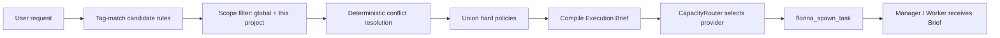

## 2. Florina -> project manager -> worker delegation hierarchy

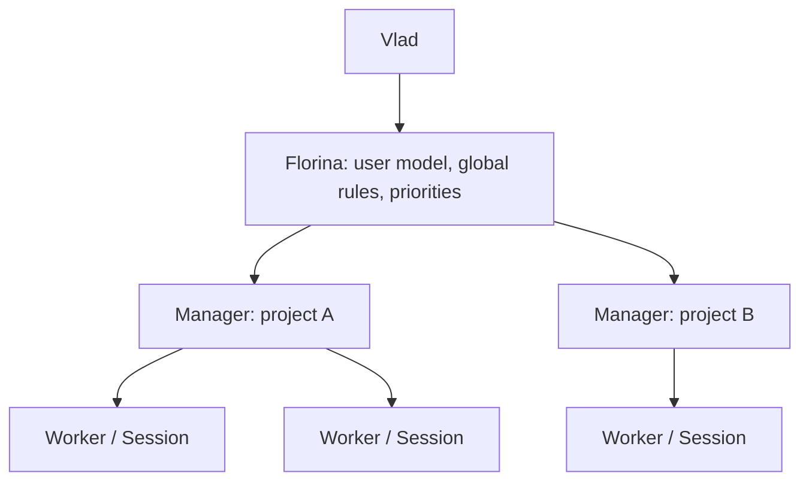

## 3. Worker event -> deterministic supervision -> reasoning escalation

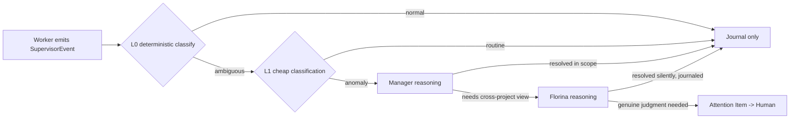

## 4. Worker question -> manager -> Florina -> human escalation

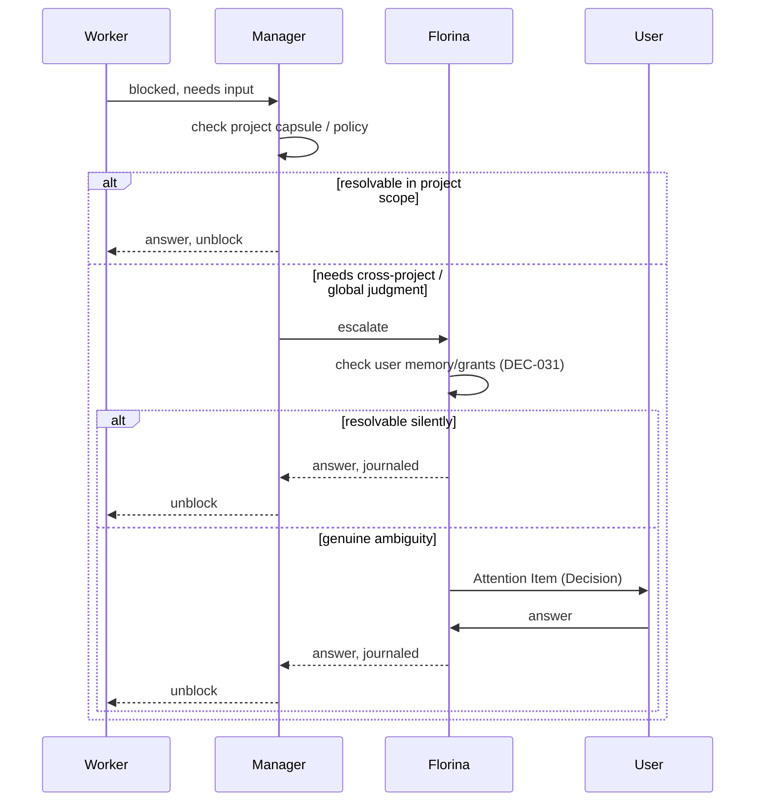

## 5. Completion claim -> verification -> accepted/rejected completion

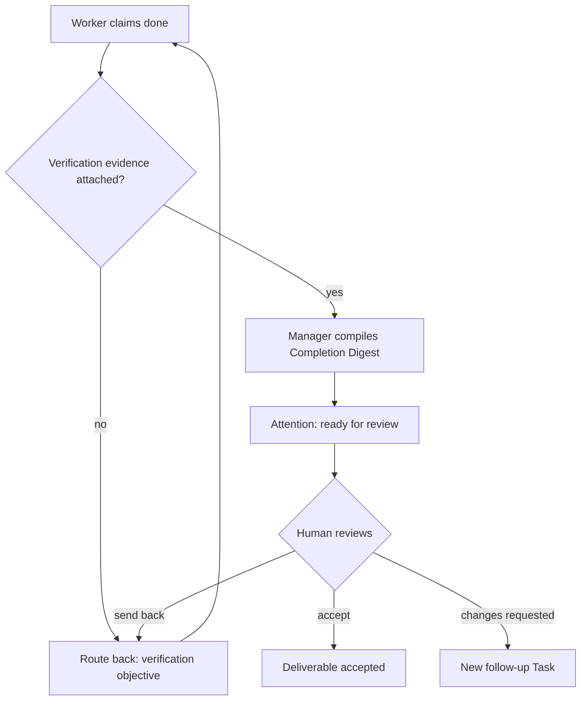

## 6. Provider failure/quota exhaustion -> rerouting/failover

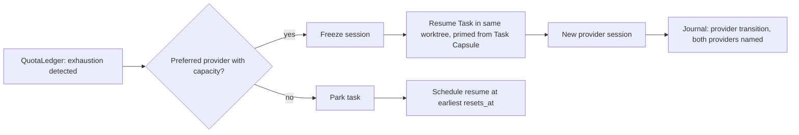

## 7. User correction -> memory extraction -> candidate/learned rule

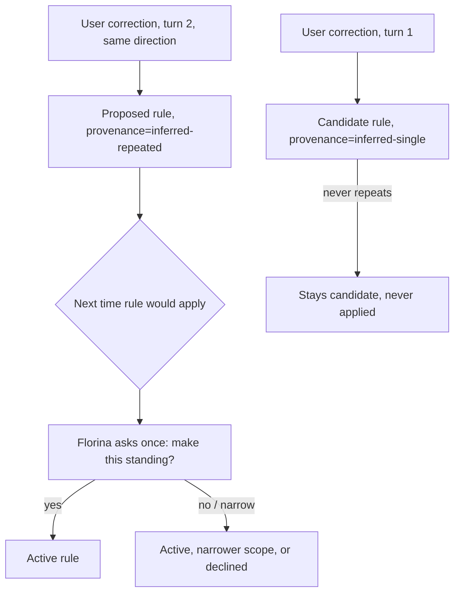

## 8. Rule retrieval/resolution/conflict handling

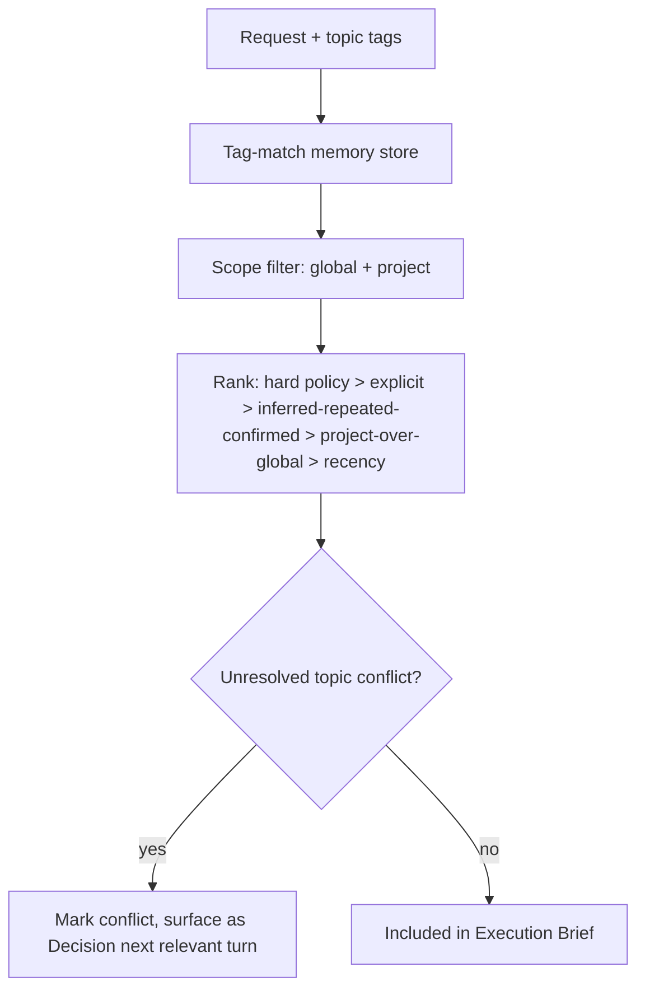

## 9. Return-from-inactivity -> state reconstruction -> catch-up digest

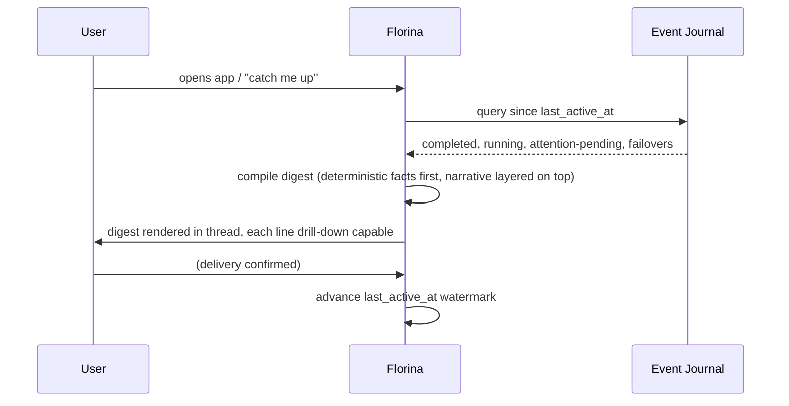

## 10. User asks "why?" -> provenance/evidence reconstruction

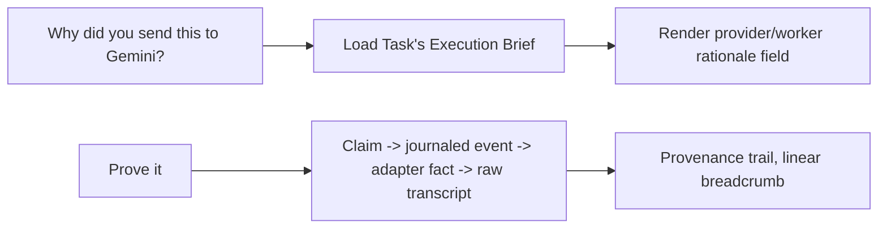

## 11. Native provider subagent discovered/managed/opaque flow

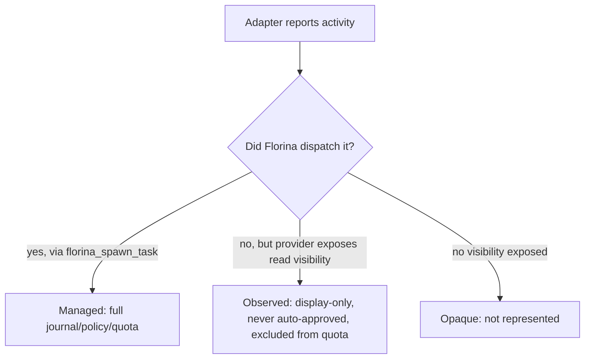

## 12. Project context + global context merging

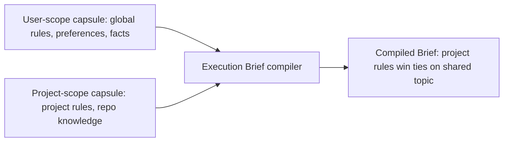
